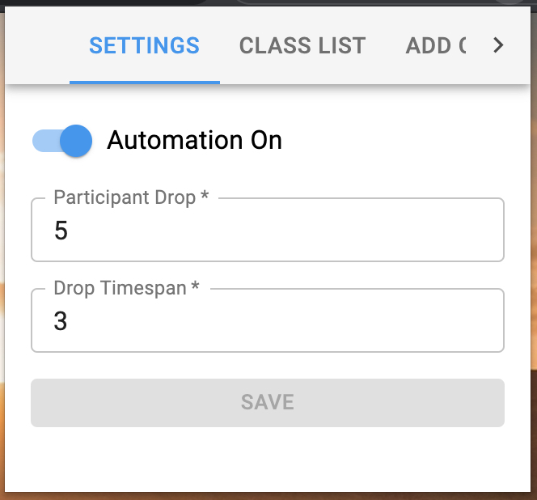
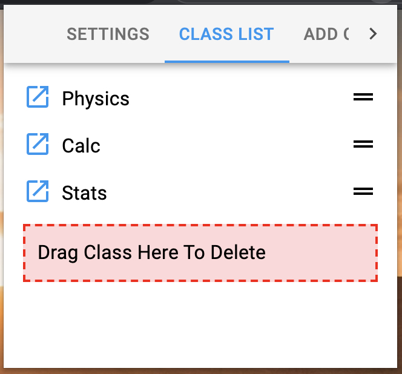
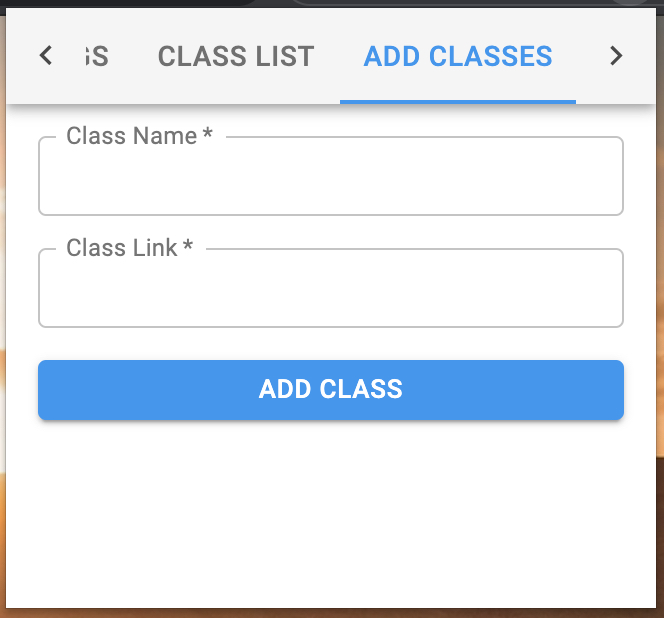

# Zoom Automator

## About

Zoom Automator is a Chrome Extension that lets you automatically leave a Zoom room if _x_ people leave within _y_ seconds (These numbers can be changed in the settings). This Chrome Extension was originally developed to aid classmates who fell asleep during online classes.

## Installation

To install Zoom Automator follow these steps:

1. Download the zip file from the [releases page](https://github.com/aniketgargya/zoom-automater/releases) and unzip it, or run the build command (`npm run build`), to create the distributable folder (`dist/`).
1. In Chrome, navigate to [chrome://extensions](chrome://extensions), and turn on developer mode.
1. Click on "Load unpacked" button and select the `dist/` folder.
1. Pin the extension by clicking the puzzle icon in the top right corner of Chrome.
1. Click on the Zoom Automator icon to modify the settings (such as turning automation on).

## Adding Zoom Links

The Zoom Automator also allows you to save your Zoom links (or any other links) right in the Chrome Extension.

In the popup that appears after clicking the Zoom Automator icon, switch to the Add Classes tab to enter Zoom links, and the Class List tab to open Zoom links or switch around the order.

## Troubleshooting

This only works when you are using the browser version of Zoom in Chrome.

When you join a Zoom room through the browser, ensure that the window is large enough to view the participant count and the leave meeting button.

A couple seconds after you join the Zoom room, the leave button and the participant count should turn blue. If they do not, you can refresh the page (this will not kick you out of the Zoom room).

## Screenshots

